# FSK Explained with Python

This article will go into a bit of the background of FSK and demonstrate
writing a simulator in Python.

## Recommended Level

Intermediate

## Frequency Shift Keying Background

The purpose of frequency shift keying (FSK) is to modulate digital signals
so they can be transmitted wirelessly. The popular wireless standard Bluetooth
uses slightly modified form of FSK called gaussian FSK. This article will focus
on binary FSK, which uses two frequency values to represent a binary value
of 1 and 0. The data is converted to these frequencies, transmitted, and then
demodulated. There are quite a few methods/circuits to modulate and demodulate
an FSK signal. This article will focus on one of the more approachable methods.

The transmitter modelled in this article assumes that two distinct frequencies
are created based on a data value. This can be realized in a circuit by using
a synthesizer or a voltage-controlled oscillator (VCO).

The receiver used in this article borrows concepts from analog FM. FM can be
demodulated by converting the frequency changes to amplitude changes. Then
techniques used to demodulate amplitude modulation (AM) can be applied. The
receiver will use a differentiator to convert the frequencies to amplitudes,
and then an envelope detector + low-pass filter to remove the carrier frequency
and leave the data. Then a data slicer is used convert the analog values to
a digital signal.

.webp)

This process can be represented mathematically by the following equations.

## Data in

```shell
        Data signal. If the data is:
        0 : m(t) = +fdev
m(t)    1 : m(t) = -fdev
        To actually implement this with a VCO, you would need to read the datasheet
        of the VCO to find out what voltage to apply in order to get the desired
        frequency out.

fdev	Frequency deviation. The amount of change from the carrier frequency.
```

## VCO

The VCO converts the digital signal to two different frequencies, represented
by `fc + fdev` and `fc - fdev`.

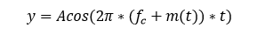

```shell
y	 Transmitted signal
A	 Amplitude of the transmitted signal
fc	 Carrier frequency
```

## Noisy Channel

Transmitting a signal over the air will introduce noise. This noise is modelled
by adding a term n(t). If the noise becomes too strong, or if the amplitude
of the signal becomes too weak, the data cannot be demodulated.

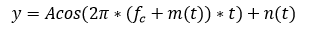

## Differentiator

The received signal is passed through a differentiator in order to separate
the data signal from the carrier frequency:

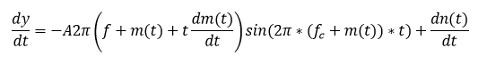

Simplifying this equation by lumping the amplitudes into one term, dropping
the phase shift and knowing that dm(t)/dt is 0 due to the constant shifts
in frequency:

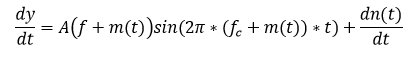

The phase shift is ignored for this example since it is a constant and
we can account for it. In real life, some sort of clock recovery or bit
syncronization scheme is needed.

## Envelope Detector + Filter

The envelope detector is needed to separate the high frequency carrier
from the low frequency digital data modulated onto the amplitude.
The filter is a low-pass type that only allows the digital data to pass
through.

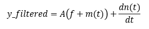

## Data Slicer

The data slicer removes the DC offset and some of the noise that will cause
problems with a digital signal being read properly. The noise term is left
because the slicer cannot remove all of the noise, and if the noise is large
enough relative to the signal (signal-to-noise ratio), the signal will become
unreadable. After the slicer we're left with the original signal.

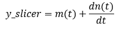

# Simulating

## Requirements

* Python 2.7
* numpy
* matplotlib
* scipy

## Data in and Setup variables

The first part of the code imports the needed libraries, sets up the FSK
parameters, and defines a plotting function. The actual simulation begins
by creating an array of random zeros and ones to use as the data stream.

```shell
import numpy as np
import pylab as pl
import scipy.signal.signaltools as sigtool
import scipy.signal as signal
from numpy.random import sample

#the following variables setup the system
Fc = 1000       #simulate a carrier frequency of 1kHz
Fbit = 50       #simulated bitrate of data
Fdev = 500      #frequency deviation, make higher than bitrate
N = 64          #how many bits to send
A = 1           #transmitted signal amplitude
Fs = 10000      #sampling frequency for the simulator, must be higher than twice the carrier frequency
A_n = 0.1       #noise peak amplitude
N_prntbits = 10 #number of bits to print in plots

def plot_data(y):
    #view the data in time and frequency domain
    #calculate the frequency domain for viewing purposes
    N_FFT = float(len(y))
    f = np.arange(0,Fs/2,Fs/N_FFT)
    w = np.hanning(len(y))
    y_f = np.fft.fft(np.multiply(y,w))
    y_f = 10*np.log10(np.abs(y_f[0:N_FFT/2]/N_FFT))
    pl.subplot(3,1,1)
    pl.plot(t[0:Fs*N_prntbits/Fbit],m[0:Fs*N_prntbits/Fbit])
    pl.xlabel('Time (s)')
    pl.ylabel('Frequency (Hz)')
    pl.title('Original VCO output versus time')
    pl.grid(True)
    pl.subplot(3,1,2)
    pl.plot(t[0:Fs*N_prntbits/Fbit],y[0:Fs*N_prntbits/Fbit])
    pl.xlabel('Time (s)')
    pl.ylabel('Amplitude (V)')
    pl.title('Amplitude of carrier versus time')
    pl.grid(True)
    pl.subplot(3,1,3)
    pl.plot(f[0:(Fc+Fdev*2)*N_FFT/Fs],y_f[0:(Fc+Fdev*2)*N_FFT/Fs])
    pl.xlabel('Frequency (Hz)')
    pl.ylabel('Amplitude (dB)')
    pl.title('Spectrum')
    pl.grid(True)
    pl.tight_layout()
    pl.show()
    
"""
Data in
"""
#generate some random data for testing
data_in = np.random.random_integers(0,1,N)
```

## VCO

The next section converts the bit stream to a sine wave with a frequency
dependent on whether or not the bit is a 1 or 0. The original bit stream
has to be extended to match the sampling frequency of the simulation. The
output of the VCO looks like the following. Notice the change in frequency
depending on the bits being sent.

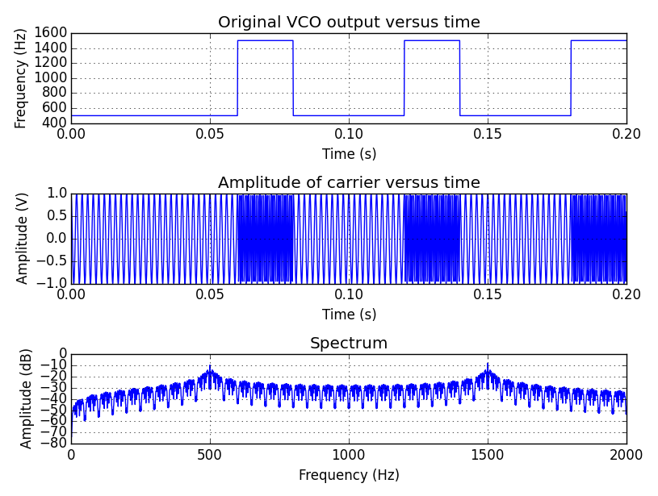

```shell
"""
VCO
"""
t = np.arange(0,float(N)/float(Fbit),1/float(Fs), dtype=np.float)
#extend the data_in to account for the bitrate and convert 0/1 to frequency
m = np.zeros(0).astype(float)
for bit in data_in:
    if bit == 0:
        m=np.hstack((m,np.multiply(np.ones(Fs/Fbit),Fc+Fdev)))
    else:
        m=np.hstack((m,np.multiply(np.ones(Fs/Fbit),Fc-Fdev)))
#calculate the output of the VCO
y=np.zeros(0)
y=A * np.cos(2*np.pi*np.multiply(m,t))
plot_data(y)
```

## Noisy Channel

The next section simulates a noisy channel by adding normally distributed
values to the transmitted signal. The code in this example is setup with
a noise amplitude of 0.1 which creates a signal-to-noise ratio of ~14dB.
Notice the noise in the time domain corrupting the signal in the following
plots.

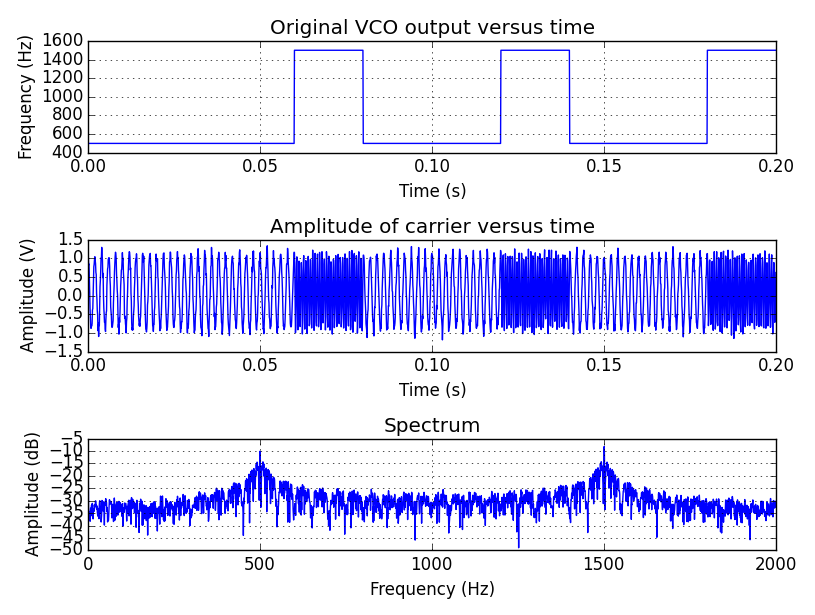

```shell
"""
Noisy Channel
"""
#create some noise
noise = (np.random.randn(len(y))+1)*A_n
snr = 10*np.log10(np.mean(np.square(y)) / np.mean(np.square(noise)))
print "SNR = %fdB" % snr
y=np.add(y,noise)
#view the data after adding noise
plot_data(y)
```

## Differentiator, Envelope Detector, and Low-Pass Filter

The differentatior is simple and is just a discrete differentation function.
The envelope detection is done using a Hilbert transform. Finally, the signal
is low-pass filtered using a 100 tap FIR filter with a cutoff frequency
of 2*bitrate. This is a fairly extreme filter, especially if it was going
to be used in an embedded system. The filter could be optimized by putting
the cutoff frequency closer to the bitrate and using less taps depending on
the need. In the following plots, the filtered data is graphed on top of
the unfiltered data to demonstrate the profound effect of the signal
transformation.

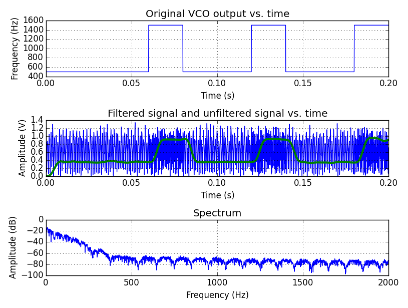

```shell
"""
Differentiator
"""
y_diff = np.diff(y,1)

"""
Envelope detector + low-pass filter
"""
#create an envelope detector and then low-pass filter
y_env = np.abs(sigtool.hilbert(y_diff))
h=signal.firwin( numtaps=100, cutoff=Fbit*2, nyq=Fs/2)
y_filtered=signal.lfilter( h, 1.0, y_env)
#view the data after adding noise
N_FFT = float(len(y_filtered))
f = np.arange(0,Fs/2,Fs/N_FFT)
w = np.hanning(len(y_filtered))
y_f = np.fft.fft(np.multiply(y_filtered,w))
y_f = 10*np.log10(np.abs(y_f[0:N_FFT/2]/N_FFT))
pl.subplot(3,1,1)
pl.plot(t[0:Fs*N_prntbits/Fbit],m[0:Fs*N_prntbits/Fbit])
pl.xlabel('Time (s)')
pl.ylabel('Frequency (Hz)')
pl.title('Original VCO output vs. time')
pl.grid(True)
pl.subplot(3,1,2)
pl.plot(t[0:Fs*N_prntbits/Fbit],np.abs(y[0:Fs*N_prntbits/Fbit]),'b')
pl.plot(t[0:Fs*N_prntbits/Fbit],y_filtered[0:Fs*N_prntbits/Fbit],'g',linewidth=3.0)
pl.xlabel('Time (s)')
pl.ylabel('Amplitude (V)')
pl.title('Filtered signal and unfiltered signal vs. time')
pl.grid(True)
pl.subplot(3,1,3)
pl.plot(f[0:(Fc+Fdev*2)*N_FFT/Fs],y_f[0:(Fc+Fdev*2)*N_FFT/Fs])
pl.xlabel('Frequency (Hz)')
pl.ylabel('Amplitude (dB)')
pl.title('Spectrum')
pl.grid(True)
pl.tight_layout()
pl.show()
```

## Slicer

The slicer takes the mean of the entire filtered signal and uses it
as a decision threshold to decide if a bit is a 1 or a 0. The decision is done
at the center of the bit period. The result is saved to an array and compared
to the original to find bit errors. The bit error percentage is printed
to the console.

```shell
"""
slicer
"""
#calculate the mean of the signal
mean = np.mean(y_filtered)
#if the mean of the bit period is higher than the mean, the data is a 0
rx_data = []
sampled_signal = y_filtered[Fs/Fbit/2:len(y_filtered):Fs/Fbit]
for bit in sampled_signal:
    if bit > mean:
        rx_data.append(0)
    else:
        rx_data.append(1)

bit_error=0
for i in range(0,len(data_in)):
    if rx_data[i#&93; != data_in[i]:
        bit_error+=1
print "bit errors = %d" % bit_error
print "bit error percent = %4.2f%%" % (float(bit_error)/float(N)*100)
```

## Result

Bit errors don't start to occur until the signal-to-noise ratio is very small.
As an example, the variable A_n is changed to 0.45, which creates an SNR
of ~2dB. At this level, out of 64 bits, only one was found to be an error.
Here are some plots demonstrating how noisy the signal is at this SNR value.

**Transmitted signal with noise**

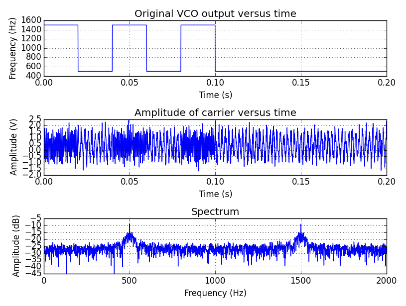

**Plot after receiving**

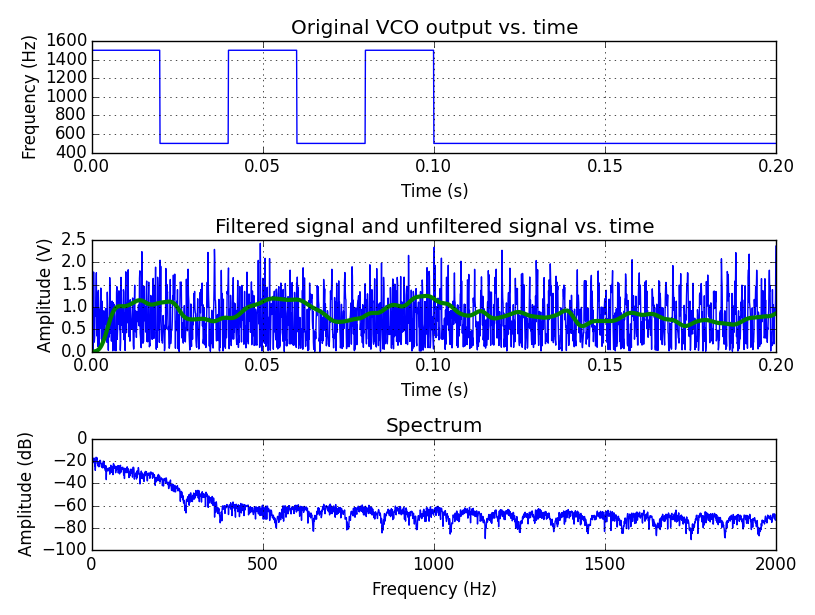
